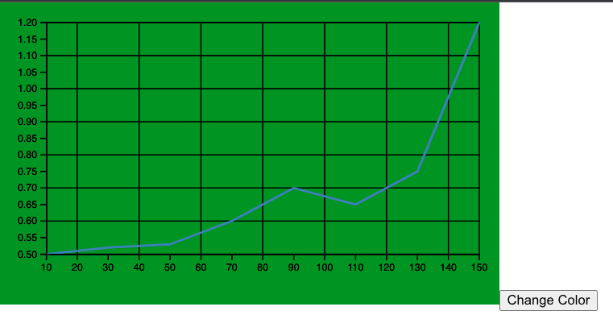

# Task assigment
I have completed a coding challenge for a regular developer position, in which I was tasked with implementing the following features:

## Requirements
- Simulating loading data into a chart
- Displaying auxiliary lines projected onto the x and y axes when hovering over chart points
- Adding a grid to the chart and a button that changes the background color of the chart to the next color in a predefined array of colors on each click
- Optionally, implementing zoom functionality using the d3 library

## My Methodology for Completing the Recruitment Task
To complete this task, I used the d3.js library to create a scalable and interactive chart. I utilized the enter-update-exit pattern to bind data to SVG elements and update the chart in response to user input. For the auxiliary lines, I used the mouseover and mouseout events to toggle the visibility of the lines and update their positions on the x and y axes. I also used d3's zoom behavior to allow the user to zoom in and out of the chart using the scroll wheel. Styling of the chart was left up to personal preference.

